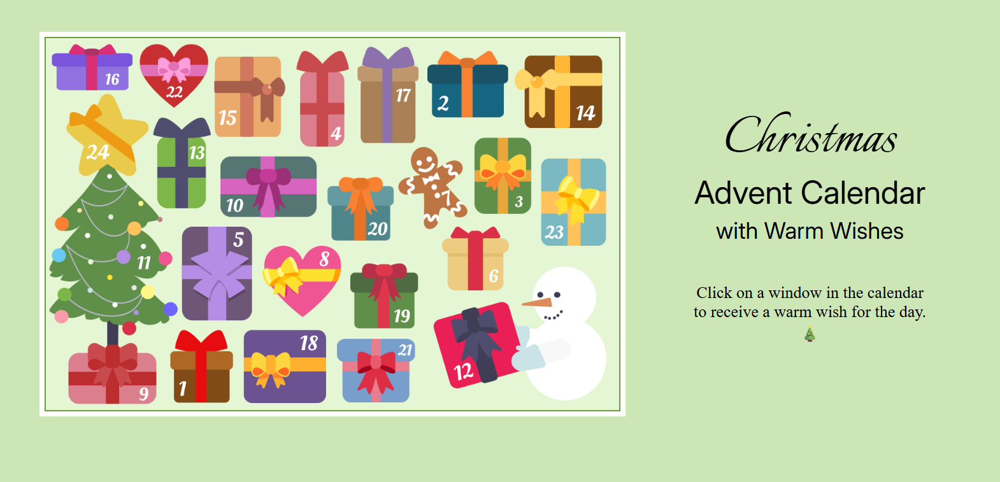
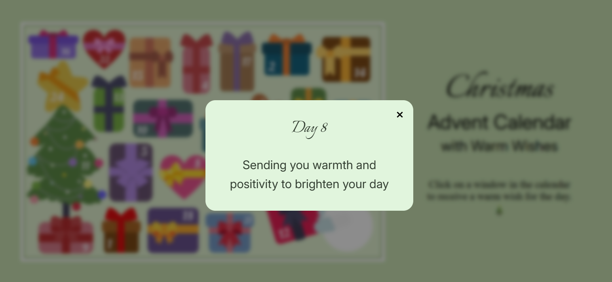

# 🎄 Advent Calendar with Warm Wishes

An interactive Advent Calendar web page built with **HTML, CSS, and vanilla JavaScript**.  
Clicking on each calendar window reveals a warm Christmas wish for the day.

The calendar automatically unlocks days based on the current date:  
all previous days and today’s window are available, while future days show a friendly “too early” message.

---

## Screenshot

---

🔗 Live Demo: https://tatiana-golub.github.io/Advent-Calendar-with-Image-Maps/

---

## ✨ Features

- Interactive Advent Calendar based on an image map
- Automatic daily unlocking (every month days 1-24 or December 1–24)
- Previous days remain accessible
- Friendly modal message for future days
- Responsive image map using `image-map-resizer`
- Custom modal window built with the native `<dialog>` element
- Clean, accessible, and framework-free implementation

---

## 🛠️ Technologies Used

- **HTML5**
  - `<map>` / `<area>` image maps
  - Native `<dialog>` modal
- **CSS3**
  - Grid and Flexbox layout
  - Custom modal styling
- **Vanilla JavaScript (ES Modules)**
  - Date-based logic
  - Event delegation
  - Modular project structure
- **image-map-resizer**
  - Responsive image map support

---

## 🎁 How It Works

- Each calendar window is defined as an `<area>` with a `data-day` attribute.
- On click, JavaScript checks the current date:
  - **Past or current day** → shows a Christmas wish.
  - **Future day** → shows a “Too early. This window will open soon” message.
- All content is displayed inside a reusable modal dialog.

---

## 🔒 Date Logic

- The project is created for demonstration purposes only, so the calendar works automatically for every month. But the project contains commented code, which, if uncommented, will allow the calendar to be used only in **December**.
- Uses the user’s local time

---

## 🚀 Getting Started

1. Clone the repository
2. Open `index.html` in your browser
3. Click on calendar windows to reveal daily wishes 🎄

No build step or dependencies required.

---

## ❤️ Acknowledgements

- The project is created to demonstrate the knowledge and skills acquired.
- Design by Introvert duo (LifePixels JS), Figma Community (CC BY 4.0)
- Design source: https://www.figma.com/community/file/1576897114990793513/interactive-advent-calendar-template
- Image map resizing powered by  
  [`image-map-resizer`](https://github.com/davidjbradshaw/image-map-resizer)
- Inspired by the tradition of Advent Calendars and Christmas warmth

